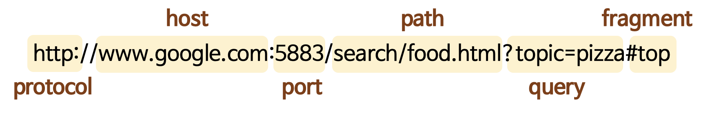

# 1.🇶 URL의 구성 요소 중 쿼리가 무엇인지 실제 웹 서비스의 쿼리를 예시로 설명해 주세요. 

- 예시: 구글에서 축구 검색 시 URL
- <https://www.google.com/search?q=%EC%B6%95%EA%B5%AC&sca_esv=b9a65900b830afa2&rlz=1C5CHFA_enKR1177KR1177&sxsrf=AE3TifOhPgQZxB6IbneG61smG1jOKj1_dw%3A1758764531019&ei=853UaLlswo2-vQ_LwaKAAw&ved=0ahUKEwj5sfW45PKPAxXChq8BHcugCDAQ4dUDCBA&uact=5&oq=%EC%B6%95%EA%B5%AC&gs_lp=Egxnd3Mtd2l6LXNlcnAaAhgBIgbstpXqtawyCBAAGIAEGLEDMgoQABiABBgUGIcCMgsQABiABBixAxiLAzILEAAYgAQYsQMYiwMyCxAAGIAEGLEDGIsDMggQABiABBiLAzILEAAYgAQYsQMYiwMyCxAAGIAEGLEDGIsDMgsQABiABBixAxiLAzIIEAAYgAQYiwNIyBZQuxBYxxRwAXgBkAEBmAHUAaABrwWqAQUwLjQuMbgBA8gBAPgBAZgCBKAC7wKoAgrCAgcQIxgnGOoCwgIHEC4YJxjqAsICDRAuGNEDGMcBGCcY6gLCAgQQIxgnwgIKECMYgAQYJxiKBcICCxAAGIAEGLEDGIMBwgIEEAAYA8ICCxAuGIAEGLEDGIMBwgIIEC4YgAQYsQPCAgUQABiABJgDBfEFk8TGeHGDgKCSBwMxLjOgB6RCsgcDMC4zuAfqAsIHBTAuMi4yyAcL&sclient=gws-wiz-serp>
   

- 아주 간단히 말하면 '물음표 이후로 나오는 것들' 이라고 할 수 있다.
- 쿼리의 구조는 key = value의 형태이다.
   

---

# 2.🇶 HTTP로 서버에 데이터를 보내는 방식에 대해 실제 웹 서비스를 예시로 리퀘스트, 리스폰스를 설명해 주세요. (크롬 개발자 도구를 활용합니다.) 

-
