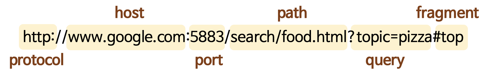
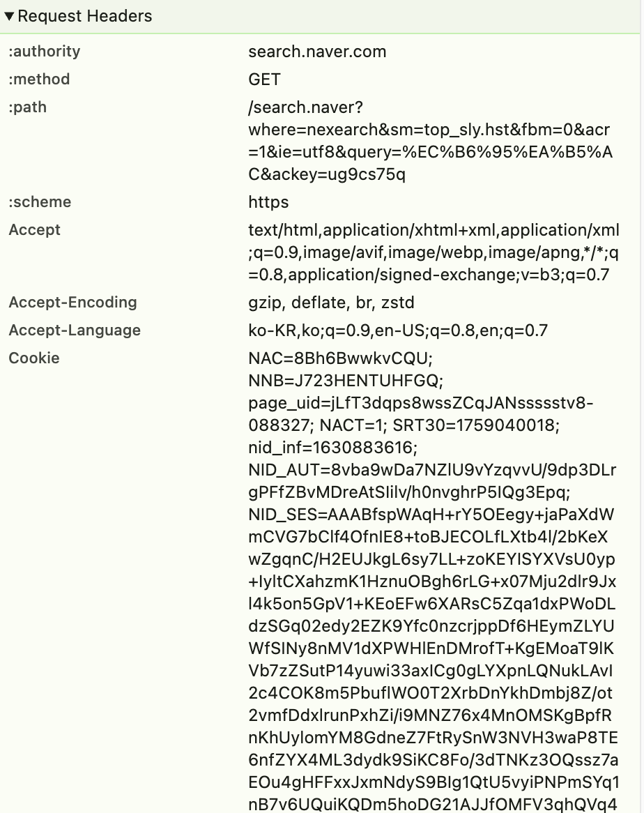
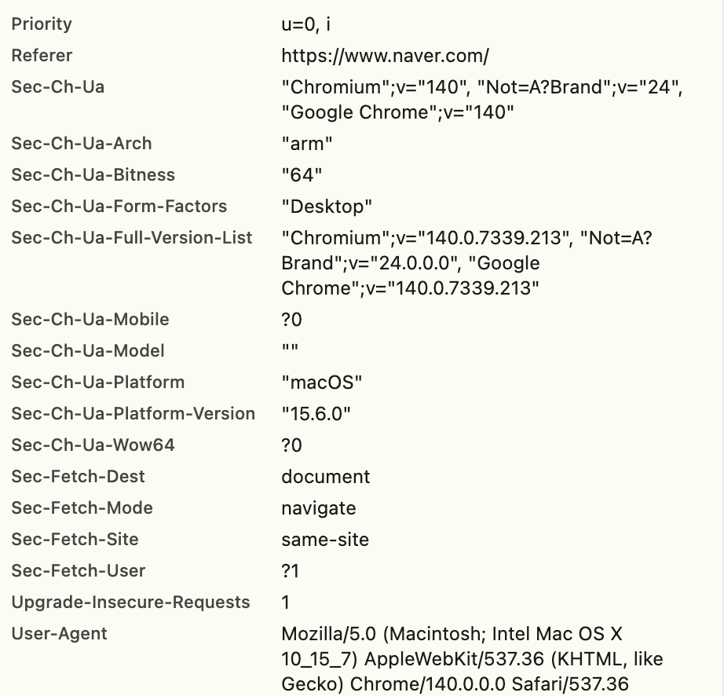
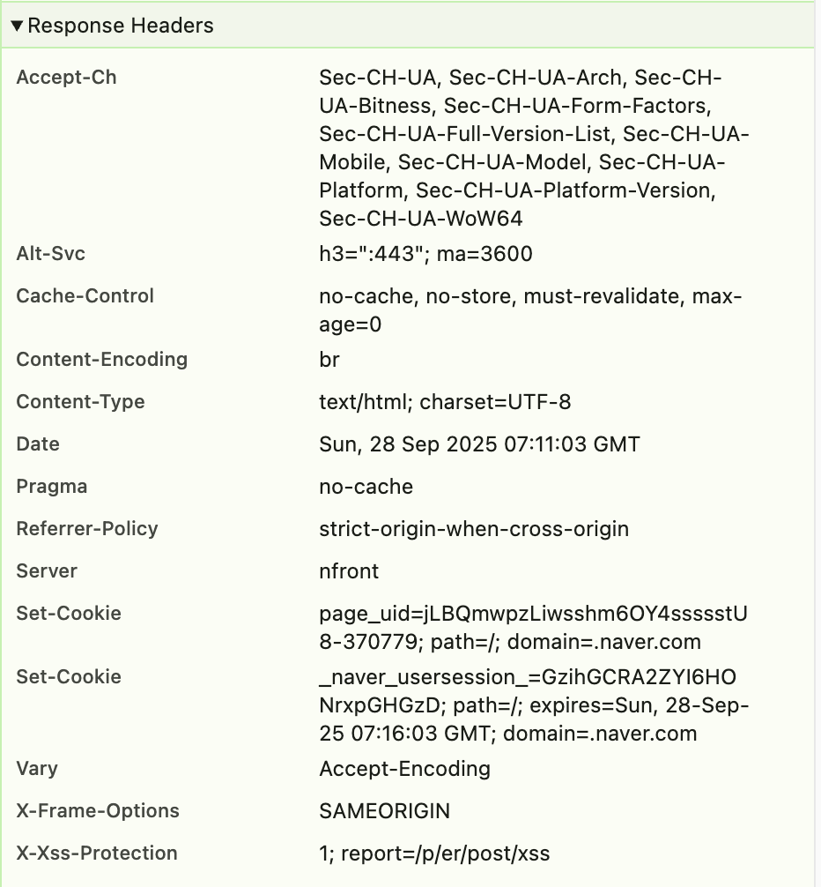

# 1.🇶 URL의 구성 요소 중 쿼리가 무엇인지 실제 웹 서비스의 쿼리를 예시로 설명해 주세요. 

- 예시: 구글에서 축구 검색 시 URL
- <https://www.google.com/search?q=축구&sca_esv=b9a65900b830afa2&rlz=1C5CHFA_enKR1177KR1177&sxsrf=AE3TifOhPgQZxB6IbneG61smG1jOKj1_dw%3A1758764531019&ei=853UaLlswo2-vQ_LwaKAAw&ved=0ahUKEwj5sfW45PKPAxXChq8BHcugCDAQ4dUDCBA&uact=5&oq=축구&gs_lp=Egxnd3Mtd2l6LXNlcnAaAhgBIgbstpXqtawyCBAAGIAEGLEDMgoQABiABBgUGIcCMgsQABiABBixAxiLAzILEAAYgAQYsQMYiwMyCxAAGIAEGLEDGIsDMggQABiABBiLAzILEAAYgAQYsQMYiwMyCxAAGIAEGLEDGIsDMgsQABiABBixAxiLAzIIEAAYgAQYiwNIyBZQuxBYxxRwAXgBkAEBmAHUAaABrwWqAQUwLjQuMbgBA8gBAPgBAZgCBKAC7wKoAgrCAgcQIxgnGOoCwgIHEC4YJxjqAsICDRAuGNEDGMcBGCcY6gLCAgQQIxgnwgIKECMYgAQYJxiKBcICCxAAGIAEGLEDGIMBwgIEEAAYA8ICCxAuGIAEGLEDGIMBwgIIEC4YgAQYsQPCAgUQABiABJgDBfEFk8TGeHGDgKCSBwMxLjOgB6RCsgcDMC4zuAfqAsIHBTAuMi4yyAcL&sclient=gws-wiz-serp>
   

- 아주 간단히 말하면 '물음표 이후로 나오는 것들' 이라고 할 수 있다.
- 쿼리의 구조는 key = value의 형태이며 여러개의 쿼리를 보내고 싶다면 &(앰퍼샌드)를 사용해 여러 개를 이어 붙인다.
- 위의 예시에서는 q=축구를 시작으로 &를 사용해 많은 쿼리가 이어져있다는 것을 알 수 있다.
   

---

# 2.🇶 HTTP로 서버에 데이터를 보내는 방식에 대해 실제 웹 서비스를 예시로 리퀘스트, 리스폰스를 설명해 주세요. (크롬 개발자 도구를 활용합니다.) 

- 클라이언트가 서버에게 연락하는 것을 요청(리퀘스트)이라고 하며 요청에 대한 정보를 담아 서버에 보내면 이 요청에 대한 응답(리스폰스)을 서버가 클라이언트 측에 해준다.
- 크롬 브라우저를 통해 네이버에 접속해 개발자 도구에서 네트워크 탭으로 들어간다. 이번에도 쿼리 예시와 같이 축구를 검색했다.

  
  
   

- 위와 같은 리퀘스트를 보내 다음과 같은 리스폰스를 받는다.
- 사용자가 운영체제에서 요청하는지 브라우저는 무엇이며 무엇을 요청하는지(예시에서는 축구를 검색함) 외에도 보안이나 언어 설정에 관련된 모든 정보들을 리퀘스트한다.

  
   

- 위와같은 리퀘스트를 받은 서버는 요청에 대한 조건들을 만족하는 응답을 해서 화면에 보여준다.

- 네트워크에서 하나의 탭만을 가지고 다뤄봤지만 많은 파일들이 있었고 그 파일들을 종합해서 우리가 검색했을 때 보여지는 화면이 만들어진다고 할 수 있다.
