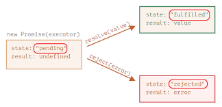

# 1. 🇶 절차지향 프로그래밍과 객체 지향 프로그래밍의 차이점에 대해 설명해 주세요.

- 절차지향 프로그래밍은 위에서 부터 순서대로 개별 명령어 중심으로 구현하는 반면 객체 지향 프로그래밍은 객체를 만들어 객체와 객체 사이의 상호작용을 중심으로 프로그램을 구현한다.
- 절차지향은 구현 복잡도가 낮고, 학습 비용이 낮다는 장점이 있고 객체지향이 재사용성, 안정성, 확장성이 높다는 장점이 있다.
- 객체지향 프로그래밍의 4원칙: 캡슐화, 추상화, 상속, 다형성

# 2. 🇶 프로미스(Promise)의 3가지 상태에 대해 설명해 주세요.

- 프로미스의 3가지 상태에는 pending, fulfilled, rejected가 있다. pending 상태는 비동기 작업이 진행 중이라는 뜻으로 주로 await를 사용하지 않으면 콘솔 창에 pending이라고 나타난다. 이는 await 사용시 해결할 수 있다. fulfilled는 비동기 작업이 성공적으로 끝남을 의미하며 fulfulled 상태가 되면 우리가 원하는 결과값을 promise객체 형태로 얻을 수 있다. rejected상태는 비동기 작업이 실패한 것을 의미하며 rejected상태가 되면 catch구문을 통해 에러를 출력할 수 있다.  
  
