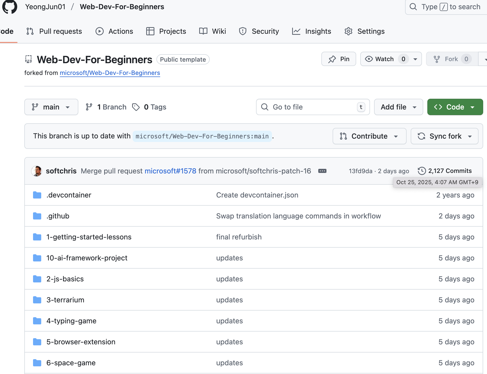

# 1. 🇶 백엔드 개발에서 CLI 명령어를 주로 활용하는 이유에 대해 설명해 주세요.

- CLI 명령줄 인터페이스
  - 키보드로 명령어를 입력하여 프로그램을 실행하는 방식 (터미널)
- 활용 이유
  1. 자동화가 쉽다.
  - scripts를 활용해 빠르게 실행 및 자동화가 쉽다.
  2. 서버 환경이 CLI 중심
  - 대부분의 백엔드 서버는 터미널만 제공한다. 따라서 CLI를 통해 서버를 관리한다.
  3. 속도와 효율성
  - 1번과 연계되는 이유로 많이 사용하는 명령어는 scripts화 해서 더 간단하게 사용할 수 있다.
  4. 배포 및 설정 자동화
  - 주요 백엔드 기술은 모두 CLI 기반 도구를 제공한다고 한다. 그리고 우리 프로젝트에서는 Git으로 프로젝트를 관리하기 때문에 Git으로 배포 및 버전 관리가 쉽다.

# 2. 🇶 오픈 소스 프로젝트 중에서 하나를 골라 어떻게 git과 Github을 통해 협업이 이루어지는지 설명해 주세요.

- 위 사진은 마이크로소프트에서 제공하는 자바스크립트의 기초적인 강의 내용을 올린 것을 내 레포로 포크한 사진이다. 대부분의 협업은 원본 저장소를 사진처럼 포크하고, 클론하여 로컬해서 개발한다. 내가 포크한 것은 프로젝트보단 강의에 가까워 PR을 보내진 않을 것 같지만 개인 로컬에서 개발을 마치면 PR을 보내고 서로의 내용을 코드리뷰를 통해 머지하면서 서로의 내용을 합친다.
