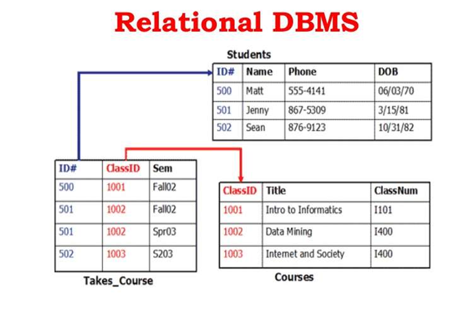

# 1. 🇶 웹 서비스에서 관계형 데이터베이스를 사용하는 이유 중 하나를 설명해 주세요.

- 관계형 데이터베이스는 데이터를 행과 열로 구성된 테이블 형식으로 구조화하며, 기본 키와 외래 키를 통해 데이블 간의 관계를 설정하는 데이터베이스 시스템이다.
- 주요 특징
   
  |특징|설명|
  |:---:|:---:|
  |테이블 구조|모든 데이터를 행(레코드)과 열(속성)을 가진 2차원 테이블로 표현|
  |열|데이터의 속성|
  |행|각 튜플(레코드)을 의미, 하나의 데이터 항목에 대한 전체 정보|
  |관계 설정|테이블은 고유한 기본 키를 가지며, 다른 테이블의 기본키를 참조하는 외래 키를 통해 서로 연결됨|
  |데이터 일관성 및 무결성|데이터 간의 관계를 명확히 하여 데이터의 중복을 방지하고 일관성을 유지하는 데 강점|
   

- 데이터의 무결성과 일관성 유지, 쉬운 데이터 검색 및 조작, 여러 테이블을 결합하여 복잡한 정보를 얻는 유연성 그리고 강화된 보안 및 데이터 통제, 통합된 데이터 관리

# 2. 🇶 Primary Key와 Foreign Key에 대해 설명해 주세요.

- 키는 관계에서 행을 식별하는데 도움이 되는 속성이다. 이를 통해 두 테이블 간의 관계를 찾을 수 있다. 키를 사용하면 해당 테이블에 있는 하나 이상의 열을 조합하여 테이블의 행을 고유하게 식별할 수 있다. 데이터베이스 키는 테이블에서 고유한 레코드나 행을 찾는 데에도 유용하다.

### 기본키(Primary Key)

- 관계형 데이터베이스 관리 시스템의 테이블에 있는 모든 행을 고유하게 식별하는 필드 또는 필드의 집합이다.
- 개체 무결성 제약 조건
  - 기본키를 구성하는 어떤 속성도 널 값을 가질 수 없으며, 오직 하나의 값만 존재해야 한다.(UNIQUE + NOT NULL)
  - 기본키는 테이블에 저장된 행 데이터를 임의로 식별하기 위한 것이며, 하나의 테이블에 하나의 기본 키 제약을 정의할 수 있다.
  - 추가적으로 기본키 설정 시, 자동으로 기본 키에 해당하는 컬럼으로 인덱스가 생성된다.

### 외래키 (Foreign Key)

- 외래키는 두 테이블 간의 관계를 생성하는 열이다. 외래키의 목적은 데이터 무결성을 유지하고 엔티티의 서로 다른 두 인스턴스 간 탐색을 허용하는 것이다. 이는 다른 테이블의 기본키를 참조하므로 두 테이블 간의 상호 참조 역할을 한다.
- 참조 무결성 제약조건
  - 자식 릴레이션의 외래키의 값은 참조된 부모 릴레이션의 기본키 값과 같아야 하며, 자식 릴레이션의 값이 변경될 때 부모 릴레이션의 제약을 받는다는 조건이다.
  - 관계형 데이터베이스에서는 컬럼의 값에 따라 테이블끼리 연결하는데 값을 참조하는 쪽의 테이블을 자식 테이블, 값을 가진 컬럼을 외래키 라고 한다.
  - 참조되는 쪽의 테이블을 부모 테이블, 값을 가진 컬럼을 부모키라고 부르며 부모키는 기본키 또는 고유키여야 한다.
